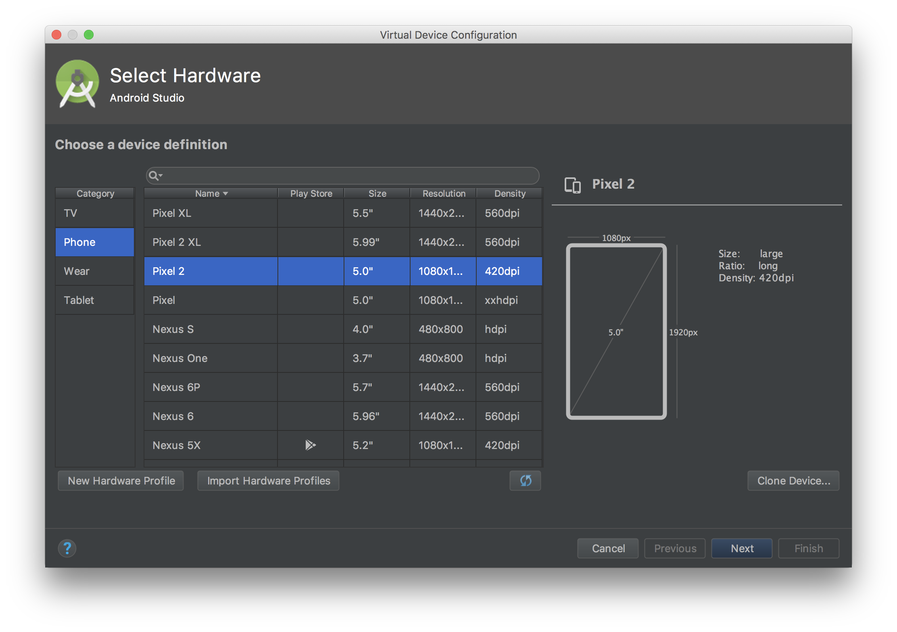
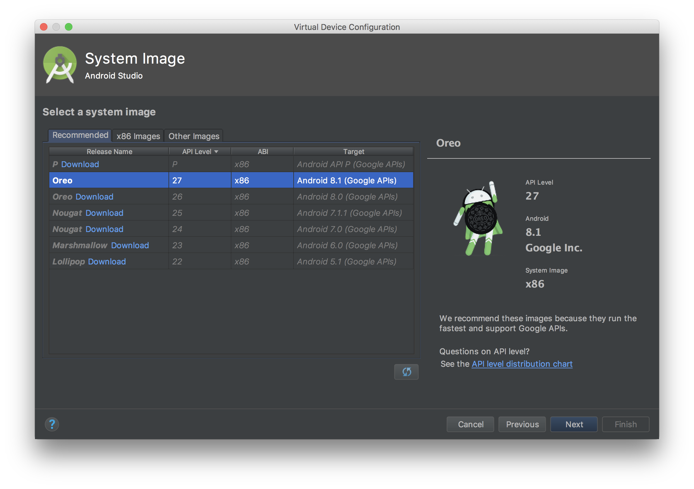
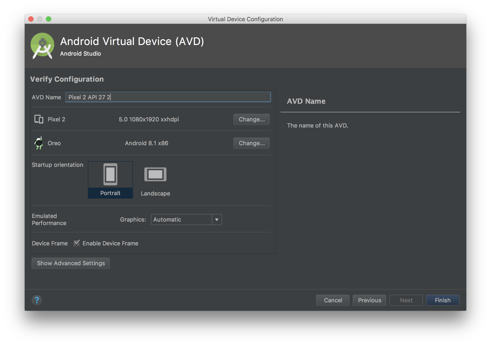

# Chathub 

A simple instant messaging app.

## Getting started

### Quick start:
```
$ git clone git@github.com:sukhjitsingh/chathub-rn.git

$ cd chathub-rn

$ npm install 

$ react-native run-android
```

## Detailed Guide: 

### Installing dependencies

You will need Node, Watchman, the React Native command line interface, a JDK, and Android Studio.

#### Node, Watchman, React Native CLI
```
$ brew install node
$ brew install watchman
$ npm install -g react-native-cli
```

#### Java Development Kit

React Native requires a recent version of the Java SE Development Kit (JDK). [Download and install JDK 8 or newer](http://www.oracle.com/technetwork/java/javase/downloads/index.html) if needed.

### Android development environment

1. Install Android Studio

[Download and install Android Studio](https://developer.android.com/studio/index.html). Choose a "Custom" setup when prompted to select an installation type. Make sure the boxes next to all of the following are checked:

>- Android SDK
>- Android SDK Platform
>- Performance (Intel ® HAXM)
>- Android Virtual Device

Then, click "Next" to install all of these components.

Once setup has finalized and you're presented with the Welcome screen, proceed to the next step.

2. Install the Android SDK

The SDK Manager can be accessed from the "Welcome to Android Studio" screen. Click on "Configure", then select "SDK Manager".

Select the "SDK Platforms" tab from within the SDK Manager, then check the box next to "Show Package Details" in the bottom right corner. Look for and expand the `Android 8.1 (Oreo)` entry, then make sure the following items are all checked:

>- Android SDK Platform 27
>- Google APIs Intel x86 Atom System Image
>- Google Play Intel x86 Atom System Image

Next, select the "SDK Tools" tab and check the box next to "Show Package Details" here as well. 

Look for and expand the "Android SDK Build-Tools" entry, then make sure that `27.0.3` is selected.

Also, here you check to see if `Intel x86 Emulator Accelerator (HAXM Installer)` is selected as well.

Finally, click "Apply" to download and install the Android SDK and related build tools.

3. Configure the ANDROID_HOME environment variable

The React Native tools require some environment variables to be set up in order to build apps with native code.

Add the following lines to your `$HOME/.bash_profile` config file:
```
export ANDROID_HOME=$HOME/Library/Android/sdk
export PATH=$PATH:$ANDROID_HOME/tools
export PATH=$PATH:$ANDROID_HOME/platform-tools
```
`.bash_profile` is specific to bash. If you're using another shell, you will need to edit the appropriate shell-specific config file.

Type source `$HOME/.bash_profile` to load the config into your current shell. Verify that ANDROID_HOME has been added to your path by running `echo $PATH`.

### **Preparing the Android device**

#### Using a physical device

1. Enable Debugging over USB

To enable USB debugging on your device, you will first need to enable the "Developer options" menu by going to **Settings → About phone** and then tapping the `Build number` row at the bottom seven times. You can then go back to **Settings → Developer options** to enable "USB debugging".

2. Plug in your device via USB

Go ahead and plug in your device via USB to your machine.
Now check that your device is properly connecting to ADB by running `adb devices`.

```
$ adb devices
List of devices attached
emulator-5554 offline   # Google emulator
14ed2fcc device         # Physical device
```
Seeing `device` in the right column means the device is connected. You must have only one device connected at a time.

3. Run your app

> $ react-native run-android

#### Using a virtual device

1. Start Android Studio using the `android` folder inside the project folder

2. Open the AVD Manager by clicking on **Tools → AVD Manager**, then clicking on Create Virtual Device bottom left corner. 

3. Select a device definition and click "Next"

4. Select a system image (Oreo), click "Next" then 'Finish"

<div style={{display: flex; flex-direction: row}}>
  
  
  
</div>

## Feedback

In case you have any feedback or questions, feel free to open a new issues on this repo or reach out to me [**@sukhjitsingh**](https://github.com/sukhjitsingh) on Github.
